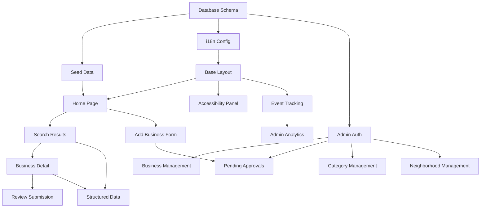

# Implementation Priorities & Dependencies

## Overview

This document provides a prioritized task list with dependencies, critical paths, and risk mitigation strategies. Use this as your daily execution guide.

---

## Critical Path Analysis

```
┌─────────────────────────────────────────────────────────────────┐
│                        CRITICAL PATH                             │
│  (These tasks MUST be completed in order)                       │
└─────────────────────────────────────────────────────────────────┘

Week 1: Setup (Phase 0)
  └─> Database Schema
      └─> Seed Data
          └─> i18n Configuration
              └─> Base Layout

Week 2-3: Core Client (Phase 1)
  └─> Home Page
      └─> Search Results (CRITICAL: Ordering logic)
          └─> Business Detail
              └─> Review Submission

Week 4: Accessibility (Phase 2)
  └─> Accessibility Panel
      └─> PWA Configuration

Week 5-6: Admin (Phase 3)
  └─> Admin Auth
      └─> Business Management
          └─> Pending Approvals

Week 7: Analytics (Phase 4)
  └─> Event Tracking
      └─> Admin Dashboard

Week 8: Polish (Phase 5)
  └─> Testing & Optimization
```

---

## Priority Matrix

### P0 - Must Have (MVP Blockers)

| Task | Depends On | Risk | Phase |
|------|------------|------|-------|
| Database schema & migrations | None | Low | 0 |
| Seed data (city, neighborhoods, categories) | Database schema | Low | 0 |
| i18n routing setup | None | Medium (RTL bugs) | 0 |
| Home page with search | i18n, seed data | Low | 1 |
| Search results with ordering logic | Home page | **High** (complex logic) | 1 |
| Business detail page | Search results | Low | 1 |
| Review submission | Business detail | Low | 1 |
| Add business form | Home page | Low | 1 |
| Admin login | None | Low | 3 |
| Pending business approval | Admin login, Add business form | Low | 3 |
| Admin business management | Admin login | Low | 3 |

### P1 - Should Have (Post-MVP Priority)

| Task | Depends On | Risk | Phase |
|------|------------|------|-------|
| Accessibility panel | Base layout | Low | 2 |
| PWA configuration | None | Medium (caching bugs) | 2 |
| Category management (admin) | Admin login | Low | 3 |
| Neighborhood management (admin) | Admin login | Low | 3 |
| Event tracking | None | Low | 4 |
| Structured data (SEO) | Business detail | Low | 4 |

### P2 - Nice to Have (Phase 6+)

| Task | Depends On | Risk | Phase |
|------|------------|------|-------|
| Admin analytics dashboard | Event tracking | Low | 4 |
| Sitemap generation | Business detail | Low | 4 |
| Full-text search | P0 complete | Medium | 6 |
| User accounts | P0 complete | Medium | 6 |
| Map view (PostGIS) | P0 complete | High | 6 |

---

## Week-by-Week Implementation Plan

### Week 1: Foundation (Phase 0)

#### Day 1: Project Initialization
**Tasks**:
- [ ] Create Next.js project
- [ ] Install dependencies (see `01-tech-stack.md`)
- [ ] Set up Git repository
- [ ] Connect Vercel project

**Validation**:
- Project runs locally on `localhost:3000`
- Vercel preview URL works

---

#### Day 2: Database Setup
**Tasks**:
- [ ] Create Prisma schema (copy from `02-database-schema.md`)
- [ ] Set up Vercel Postgres (or Supabase)
- [ ] Run initial migration: `npx prisma migrate dev --name init`
- [ ] Verify in Prisma Studio: `npx prisma studio`

**Validation**:
- All tables created
- No migration errors

---

#### Day 3: Seed Data
**Tasks**:
- [ ] Create seed script (`prisma/seed.ts`)
- [ ] Seed city (נתניה)
- [ ] Seed 3 neighborhoods (צפון, דרום, מזרח)
- [ ] Seed 10+ categories
- [ ] Seed admin user (with hashed password)
- [ ] Seed admin settings (top_pinned_count = 4)

**Validation**:
- Prisma Studio shows all seed data
- Categories and neighborhoods appear in dropdowns

---

#### Day 4: Redis & i18n
**Tasks**:
- [ ] Set up Upstash Redis account
- [ ] Create Redis client (`lib/redis.ts`)
- [ ] Test Redis connection (set/get)
- [ ] Configure next-intl
- [ ] Create `middleware.ts` for locale routing
- [ ] Create `messages/he.json` and `messages/ru.json`
- [ ] Test `/he` and `/ru` routes

**Validation**:
- `/he` loads with Hebrew content (RTL)
- `/ru` loads with Russian content (LTR)
- Language switcher works

---

#### Day 5: Base Layout & Styling
**Tasks**:
- [ ] Configure Tailwind for RTL
- [ ] Add Heebo font
- [ ] Create root layout with AccessibilityProvider
- [ ] Create header with logo + language switcher
- [ ] Create footer
- [ ] Add skip link ("דלג לתוכן")
- [ ] Test in both HE and RU

**Validation**:
- RTL layout works in Hebrew
- LTR layout works in Russian
- Skip link appears on tab focus

---

### Week 2-3: Core Client Pages (Phase 1)

#### Days 6-7: Home Page
**Tasks**:
- [ ] Create `HeroSection` component
- [ ] Create `SearchForm` client component
  - [ ] Category dropdown (Headless UI Listbox)
  - [ ] Neighborhood dropdown
  - [ ] Validation: both required
- [ ] Create `PopularCategories` component
- [ ] Create `NeighborhoodGrid` component
- [ ] Fetch categories and neighborhoods (Server Component)
- [ ] Test search submission (redirects to results page)

**Validation**:
- Home page loads in <2 seconds
- Search requires both category + neighborhood
- Clicking popular category navigates to results
- Clicking neighborhood navigates to results

**Critical**: Test with BOTH Hebrew and Russian content

---

#### Days 8-10: Search Results Page ⚠️ CRITICAL
**Tasks**:
- [ ] Create dynamic route: `app/[locale]/netanya/[neighborhood]/[category]/page.tsx`
- [ ] Implement `getSearchResults` query (see `04-api-endpoints.md`)
- [ ] **CRITICAL**: Implement ordering logic:
  - [ ] Separate pinned from regular businesses
  - [ ] Get top X pinned (from admin settings)
  - [ ] Random 5 from remaining
  - [ ] Rest sorted by rating DESC, then newest
- [ ] Create `BusinessCard` component
  - [ ] Conditional rendering: WhatsApp button (only if whatsapp_number exists)
  - [ ] Conditional rendering: Call button (only if phone exists)
  - [ ] Show rating or "היו הראשונים לדרג"
- [ ] Create `NoResults` component with "search all city" button
- [ ] Create `FilterSheet` component (for later)
- [ ] Track search event (analytics)

**Validation**:
- [ ] Results show in correct order (pinned first, then random 5, then rest)
- [ ] Top X count matches admin setting (default 4)
- [ ] Random 5 changes on page refresh
- [ ] Business cards show correct CTAs (no WhatsApp button if no whatsapp_number)
- [ ] No results flow works (shows button, redirects to all neighborhoods)
- [ ] Rating calculation is accurate
- [ ] Verified badge shows for verified businesses

**Testing Checklist**:
- [ ] Create 10 test businesses in DB
- [ ] Mark 4 as pinned with pinned_order 1-4
- [ ] Verify first 4 results are those exact businesses in that order
- [ ] Verify next 5 are random (refresh page, order changes)
- [ ] Verify rest are sorted by rating

**Risk Mitigation**:
- Write unit test for ordering logic before implementing
- Console.log each step of ordering to debug
- Use Prisma Studio to verify business flags

---

#### Days 11-12: Business Detail Page
**Tasks**:
- [ ] Create `app/[locale]/business/[slug]/page.tsx`
- [ ] Implement `getBusiness` query
- [ ] Create `BusinessDetail` component
  - [ ] Header (name, category, neighborhood, rating)
  - [ ] CTA grid (2x2 on mobile)
    - [ ] WhatsApp (only if whatsapp_number)
    - [ ] Call (only if phone)
    - [ ] Directions (only if address)
    - [ ] Website (only if website_url)
  - [ ] Info section (description, address, opening hours) - **conditional**
  - [ ] Reviews list
- [ ] Create `ReviewsList` component
- [ ] Add structured data (LocalBusiness schema)
- [ ] Track business_viewed event

**Validation**:
- [ ] All conditional fields work correctly (hide section if no data)
- [ ] CTA buttons only show if data exists
- [ ] Clicking WhatsApp opens wa.me link
- [ ] Clicking Call opens tel: link
- [ ] Clicking Directions opens Google Maps
- [ ] Reviews show in reverse chronological order
- [ ] Average rating calculated correctly
- [ ] Google Rich Results Test passes for structured data

---

#### Days 13-14: Review Submission
**Tasks**:
- [ ] Create `app/[locale]/business/[slug]/review/page.tsx`
- [ ] Create `ReviewForm` client component (React Hook Form + Zod)
  - [ ] Star rating selector (1-5)
  - [ ] Comment textarea (optional)
  - [ ] Name input (optional)
- [ ] Create `submitReview` server action
  - [ ] Validation
  - [ ] Rate limiting (5 per hour per IP)
  - [ ] Save to reviews table (with correct comment_he/comment_ru)
  - [ ] Track event
  - [ ] Revalidate business page
- [ ] Success state (redirect to business page)
- [ ] Error handling

**Validation**:
- [ ] Can submit review with just rating
- [ ] Can submit review with rating + comment
- [ ] Anonymous reviews work (no name provided)
- [ ] Rate limiting works (try 6 submissions in 1 hour)
- [ ] Review appears on business page immediately
- [ ] Average rating updates

---

#### Days 15-16: Add Business Form
**Tasks**:
- [ ] Create `app/[locale]/add-business/page.tsx`
- [ ] Create `AddBusinessForm` client component (React Hook Form + Zod)
  - [ ] All fields from `sysAnal.md:143-161`
  - [ ] **CRITICAL**: Validation: must have phone OR whatsapp_number
  - [ ] Error message: "חובה למלא טלפון או מספר ווטסאפ אחד לפחות"
- [ ] Create `submitBusiness` server action
  - [ ] Validation with Zod refine
  - [ ] Rate limiting (3 per day per IP)
  - [ ] Save to pending_businesses
  - [ ] Track event
- [ ] Create success page
- [ ] Error handling

**Validation**:
- [ ] Form validation works (required fields)
- [ ] **CRITICAL**: Cannot submit without phone OR whatsapp
- [ ] Error shows on correct field if both missing
- [ ] Submission creates pending_business record
- [ ] Rate limiting works (try 4 submissions in 1 day)
- [ ] Success page shows confirmation

---

### Week 4: Accessibility & PWA (Phase 2)

#### Days 17-18: Accessibility Panel
**Tasks**:
- [ ] Create `AccessibilityContext` (font size, contrast, underline links)
- [ ] Create `AccessibilityButton` (fixed bottom-right)
- [ ] Create `AccessibilityPanel` (Dialog with Headless UI)
  - [ ] Font size toggle (Normal / Medium / Large)
  - [ ] High contrast toggle
  - [ ] Underline links toggle
- [ ] Add global CSS for accessibility classes
- [ ] Persist settings in localStorage
- [ ] Track accessibility events

**Validation**:
- [ ] Panel opens on button click
- [ ] Font size changes apply immediately
- [ ] High contrast mode works (dark text, white bg, strong outlines)
- [ ] Underline links works
- [ ] Settings persist across page reloads
- [ ] Settings persist across sessions

---

#### Days 19-20: Semantic HTML & ARIA
**Tasks**:
- [ ] Audit all pages for semantic HTML
  - [ ] Replace divs with main, header, nav, footer, button
- [ ] Add aria-labels to all icon buttons
- [ ] Add labels to all form inputs (with htmlFor)
- [ ] Ensure logical tab order
- [ ] Add focus-visible styles (never remove outlines!)
- [ ] Run axe DevTools on all pages

**Validation**:
- [ ] axe DevTools: 0 critical issues
- [ ] Can navigate entire site with keyboard only
- [ ] Tab order is logical
- [ ] All buttons have visible focus states
- [ ] Screen reader test (NVDA or VoiceOver)

---

#### Day 21: PWA Configuration
**Tasks**:
- [ ] Install next-pwa
- [ ] Configure `next.config.js` with caching strategies
- [ ] Create `public/manifest.json`
- [ ] Add PWA meta tags to layout
- [ ] Create offline fallback page
- [ ] Test PWA install on iOS Safari and Android Chrome
- [ ] Track pwa_installed event

**Validation**:
- [ ] PWA installs on iOS Safari
- [ ] PWA installs on Android Chrome
- [ ] Offline mode shows fallback page (turn off wifi, reload)
- [ ] Service worker caches static assets
- [ ] Google Maps, WhatsApp links never cached (NetworkOnly)

---

### Week 5-6: Admin Panel (Phase 3)

#### Days 22-23: Admin Authentication
**Tasks**:
- [ ] Configure NextAuth (see `04-api-endpoints.md`)
- [ ] Create `app/admin/login/page.tsx`
- [ ] Create login form (email + password)
- [ ] Create `auth.ts` with Credentials provider
- [ ] **MVP**: Hardcoded check (email === "345287@gmail.com" && password === "admin1")
- [ ] **Production**: Hash password, store in DB
- [ ] Create `app/admin/layout.tsx` with auth check
- [ ] Create admin sidebar navigation

**Validation**:
- [ ] Can log in with correct credentials
- [ ] Cannot log in with incorrect credentials
- [ ] Cannot access /admin pages without login
- [ ] After login, redirected to /admin dashboard

---

#### Days 24-26: Business Management
**Tasks**:
- [ ] Create `app/admin/businesses/page.tsx`
- [ ] Create `BusinessTable` component
  - [ ] Show all businesses (paginated)
  - [ ] Columns: Name, Category, Neighborhood, IsVisible, IsVerified, IsPinned, CreatedAt
- [ ] Create server actions:
  - [ ] `toggleVisible`
  - [ ] `toggleVerified`
  - [ ] `togglePinned` (assign pinned_order automatically)
  - [ ] `deleteBusiness` (soft delete)
- [ ] Create edit business page
- [ ] Test all actions

**Validation**:
- [ ] Toggle visible: business disappears from search results
- [ ] Toggle verified: "מאומת" badge appears on business card
- [ ] Toggle pinned: business moves to top X in search results
- [ ] Pinned order is automatically assigned
- [ ] Soft delete: business not shown but still in DB

---

#### Days 27-28: Pending Business Approvals
**Tasks**:
- [ ] Create `app/admin/pending/page.tsx`
- [ ] Create `PendingTable` component
  - [ ] Show all pending businesses
  - [ ] Columns: Name, Category, Neighborhood, Phone/WhatsApp, Submitted At
- [ ] Create server actions:
  - [ ] `approveBusiness` (create new business, update pending status)
  - [ ] `rejectBusiness` (update status, add admin notes)
- [ ] Test approval flow

**Validation**:
- [ ] Approve creates new business in businesses table
- [ ] Approved business is visible in search results (if is_visible = true)
- [ ] Reject updates status but doesn't create business
- [ ] Pending list shows badge count in sidebar

---

#### Days 29-30: Category & Neighborhood Management
**Tasks**:
- [ ] Create `app/admin/categories/page.tsx`
  - [ ] CRUD operations (create, update, delete)
  - [ ] Toggle active/inactive
  - [ ] Mark as popular
- [ ] Create `app/admin/neighborhoods/page.tsx`
  - [ ] CRUD operations
  - [ ] Toggle active/inactive
- [ ] Invalidate Redis cache on updates

**Validation**:
- [ ] Creating category: appears in search dropdown
- [ ] Deactivating category: removed from dropdown but existing businesses still work
- [ ] Popular category: appears in "Popular Categories" section
- [ ] Redis cache invalidates on update (verify in Redis)

---

#### Day 31: Admin Settings
**Tasks**:
- [ ] Create `app/admin/settings/page.tsx`
- [ ] Add setting: Top Pinned Count (default 4)
- [ ] Create `updateSetting` server action
- [ ] Test updating setting

**Validation**:
- [ ] Changing top pinned count affects search results
- [ ] If set to 2, only first 2 pinned businesses show in "Top X" section

---

### Week 7: Analytics & SEO (Phase 4)

#### Days 32-33: Event Tracking
**Tasks**:
- [ ] Create `app/api/events/route.ts`
- [ ] Create `AnalyticsContext` with `trackEvent` method
- [ ] Add tracking to all key actions:
  - [ ] Search performed (on search submit)
  - [ ] Business viewed (on business detail mount)
  - [ ] CTA clicked (on WhatsApp/Call/Directions/Website click)
  - [ ] Review submitted
  - [ ] Business submitted
  - [ ] PWA installed
  - [ ] Accessibility opened
  - [ ] Font/contrast changed
- [ ] Rate limit events endpoint (100 per minute per IP)

**Validation**:
- [ ] Events saved to database
- [ ] Prisma Studio shows events with correct type and properties
- [ ] Rate limiting works

---

#### Days 34-35: SEO & Structured Data
**Tasks**:
- [ ] Add LocalBusiness schema to business detail pages
- [ ] Add hreflang tags for HE/RU versions
- [ ] Create sitemap.ts (dynamic sitemap)
- [ ] Create robots.ts
- [ ] Add meta descriptions to all pages
- [ ] Test with Google Rich Results Test

**Validation**:
- [ ] Google Rich Results Test passes
- [ ] Sitemap accessible at /sitemap.xml
- [ ] Robots.txt accessible at /robots.txt
- [ ] hreflang tags present on all pages

---

#### Days 36-37: Admin Analytics Dashboard
**Tasks**:
- [ ] Create `app/admin/analytics/page.tsx`
- [ ] Create queries for analytics data (see `04-api-endpoints.md`)
  - [ ] Top categories (last 7 days)
  - [ ] Top neighborhoods
  - [ ] Total searches, views, reviews
  - [ ] CTA distribution
  - [ ] Language distribution
  - [ ] Accessibility usage
- [ ] Create simple charts (can use Chart.js or Recharts)
- [ ] Add date range filter

**Validation**:
- [ ] Dashboard shows correct data
- [ ] Date range filter works
- [ ] Charts render correctly

---

### Week 8: Polish & Launch (Phase 5)

#### Days 38-40: Performance Optimization
**Tasks**:
- [ ] Run Lighthouse on all pages
- [ ] Optimize images (use Next.js Image component)
- [ ] Lazy load below-fold components
- [ ] Add loading skeletons
- [ ] Analyze bundle size (next/bundle-analyzer)
- [ ] Fix any performance issues

**Target**:
- [ ] Lighthouse Performance: 90+
- [ ] Lighthouse Accessibility: 100
- [ ] Lighthouse Best Practices: 100
- [ ] Lighthouse SEO: 100

---

#### Days 41-42: Cross-Browser Testing
**Tasks**:
- [ ] Test on Chrome (desktop + mobile)
- [ ] Test on Safari (desktop + iOS)
- [ ] Test on Firefox
- [ ] Test on Edge
- [ ] Fix any browser-specific issues

**Checklist**:
- [ ] RTL/LTR switching works
- [ ] Accessibility panel works
- [ ] PWA installs
- [ ] All forms submit correctly
- [ ] Search flow works end-to-end

---

#### Days 43-44: Security Audit
**Tasks**:
- [ ] Review all environment variables (not exposed to client)
- [ ] Hash admin password (bcrypt)
- [ ] Verify rate limiting on all public endpoints
- [ ] Verify CSRF protection (NextAuth default)
- [ ] Verify no SQL injection vulnerabilities (Prisma handles this)
- [ ] Verify no XSS vulnerabilities (React escapes by default)
- [ ] Add security headers (Vercel does this by default, but verify)

**Validation**:
- [ ] No secrets in client-side code
- [ ] Admin password is hashed
- [ ] Rate limiting works on all endpoints
- [ ] HTTPS enforced

---

#### Days 45-46: Final Testing & Bug Fixes
**Tasks**:
- [ ] E2E test full user journey:
  - [ ] Home → Search → Results → Business Detail → Review
  - [ ] Home → Add Business → Success
- [ ] E2E test admin journey:
  - [ ] Login → Approve Business → Edit Business → Toggle Flags
- [ ] Fix any remaining bugs
- [ ] Test with real data (not seed data)

---

#### Day 47: Launch 🚀
**Tasks**:
- [ ] Final deployment to Vercel
- [ ] Verify production environment variables
- [ ] Test production URL
- [ ] Monitor Vercel logs for errors
- [ ] Announce launch!

---

## Dependency Graph



---

## Risk Register

### High Risk Tasks

#### 1. Search Results Ordering Logic
**Risk**: Incorrect implementation breaks core functionality
**Probability**: Medium
**Impact**: Critical

**Mitigation**:
- Write unit tests BEFORE implementing
- Console.log each step during development
- Test with 20+ businesses in DB with various pinned states
- Verify with product requirements (sysAnal.md:87-91)

**Testing Checklist**:
```typescript
// Test cases
1. 0 businesses: Show "no results"
2. 1-4 businesses, all pinned: Show all in pinned_order
3. 5+ businesses, 4 pinned: Top 4 pinned + random 5 + rest
4. 10 businesses, 0 pinned: Random 5 + rest by rating
5. 20 businesses, 10 pinned, topPinnedCount=4: First 4 pinned + random 5 from remaining 16
```

---

#### 2. RTL/LTR Layout Issues
**Risk**: Hebrew layout breaks or looks bad
**Probability**: Medium
**Impact**: High

**Mitigation**:
- Use Tailwind RTL plugin
- Use logical properties (ms-4 instead of ml-4)
- Test EVERY component in both directions
- Use `dir="rtl"` on html element
- Never hardcode left/right in CSS

**Testing**:
- Test on actual iPhone with Hebrew iOS
- Test with Hebrew screen reader (NVDA)

---

#### 3. PWA Service Worker Caching
**Risk**: Caching breaks dynamic content or WhatsApp links
**Probability**: Low
**Impact**: High

**Mitigation**:
- Use NetworkFirst strategy for all pages
- Use NetworkOnly for WhatsApp, tel:, mailto: links
- Never cache /api routes
- Test offline mode thoroughly
- Provide clear "Update Available" UI

**Testing**:
- Turn off wifi, reload page
- Verify cached pages load
- Verify new data fetches when online
- Verify WhatsApp links never cached

---

### Medium Risk Tasks

#### 4. Accessibility Compliance (WCAG AA)
**Risk**: Fail accessibility audit, legal issues in Israel
**Probability**: Low
**Impact**: High

**Mitigation**:
- Run axe DevTools on every page
- Manual keyboard navigation testing
- Screen reader testing (NVDA for Hebrew)
- Color contrast checker (WebAIM)
- Get legal review of WCAG checklist

**Resources**:
- Israeli Accessibility Regulations: https://www.gov.il/he/Departments/Guides/accessibility
- WCAG 2.1 AA: https://www.w3.org/WAI/WCAG21/quickref/?currentsidebar=%23col_customize&levels=aaa

---

#### 5. Phone/WhatsApp Validation
**Risk**: Users submit business without any contact method
**Probability**: Low (good validation)
**Impact**: Medium

**Mitigation**:
- Zod refine validation (must have phone OR whatsapp)
- Clear error message in Hebrew
- Test validation with empty inputs
- Test validation with only phone
- Test validation with only whatsapp

---

### Low Risk Tasks

#### 6. Rate Limiting
**Risk**: Users abuse forms (spam reviews/businesses)
**Probability**: Low
**Impact**: Low

**Mitigation**:
- Redis-based rate limiting
- Hash IP addresses for privacy
- Clear error messages
- Monitor abuse in admin

---

## Blockers & Resolution

### Potential Blockers

| Blocker | Impact | Resolution |
|---------|--------|------------|
| Vercel Postgres setup issues | Cannot start development | Use Supabase as fallback |
| Upstash Redis unavailable | Cannot implement rate limiting, bug tracking | Use local Redis (Docker) for development |
| Heebo font loading slow | Performance issues | Use font-display: swap, preload |
| Next.js App Router bugs | Development blocked | Check Next.js GitHub issues, downgrade if needed |
| Prisma migration fails | Cannot seed data | Drop database, re-run migrations |

---

## Daily Checklist Template

```markdown
## Day X: [Task Name]

### Morning (3 hours)
- [ ] Read related docs
- [ ] Set up files/components
- [ ] Implement core logic

### Afternoon (3 hours)
- [ ] Test implementation
- [ ] Fix bugs
- [ ] Write tests (if applicable)

### Validation
- [ ] Feature works as expected
- [ ] No console errors
- [ ] Passes validation checklist
- [ ] Git commit with clear message

### Blockers
- None / [Describe blocker + resolution]
```

---

## Success Metrics

### Phase 0 (Week 1)
- [ ] Database migrated with 0 errors
- [ ] Seed data visible in Prisma Studio
- [ ] Both /he and /ru routes work
- [ ] RTL/LTR switching works

### Phase 1 (Week 2-3)
- [ ] Can complete full search flow (home → results → detail → review)
- [ ] Search results ordering matches requirements
- [ ] No results flow works
- [ ] Can submit business

### Phase 2 (Week 4)
- [ ] Accessibility panel works and persists
- [ ] PWA installs on mobile
- [ ] axe DevTools: 0 critical issues

### Phase 3 (Week 5-6)
- [ ] Admin can log in
- [ ] Admin can approve pending businesses
- [ ] Admin can edit businesses and toggle flags
- [ ] Admin can manage categories/neighborhoods

### Phase 4 (Week 7)
- [ ] All events tracked
- [ ] Business pages have LocalBusiness schema
- [ ] Sitemap generated
- [ ] Admin analytics dashboard shows data

### Phase 5 (Week 8)
- [ ] Lighthouse: 90+ performance, 100 accessibility
- [ ] Works on all major browsers
- [ ] No security issues
- [ ] Production deployed

---

## Post-Launch Monitoring

### Week 1 Post-Launch
- [ ] Monitor Vercel logs daily
- [ ] Check admin analytics dashboard daily
- [ ] Respond to any user feedback
- [ ] Fix critical bugs within 24 hours

### Week 2-4 Post-Launch
- [ ] Review analytics weekly
- [ ] Check for missing categories/neighborhoods
- [ ] Monitor Redis bug tracking
- [ ] Iterate based on feedback

### Monthly
- [ ] Review performance metrics
- [ ] Analyze top categories/neighborhoods
- [ ] Review CTA distribution (WhatsApp vs Call)
- [ ] Plan Phase 6 features

---

## Emergency Rollback Plan

### If Critical Bug in Production
1. **Immediately**: Revert deployment in Vercel (Deployments → Previous → Promote)
2. **Within 1 hour**: Identify bug, fix locally, test thoroughly
3. **Within 4 hours**: Deploy fix to Vercel
4. **Within 24 hours**: Post-mortem (what went wrong, how to prevent)

### If Database Migration Fails
1. **Do NOT run migrations in production first**
2. **Always test migrations on staging environment**
3. **If migration fails in production**: Roll back with `npx prisma migrate resolve --rolled-back [migration_name]`

---

## Quick Reference: Most Critical Files

### Must Get Right
1. `lib/queries/businesses.ts` → `getSearchResults` function (ordering logic)
2. `lib/validations/business.ts` → Phone/WhatsApp validation (Zod refine)
3. `middleware.ts` → i18n routing (RTL/LTR)
4. `prisma/schema.prisma` → Database schema (relationships, indexes)
5. `app/[locale]/netanya/[neighborhood]/[category]/page.tsx` → Search results page

### High Risk of Bugs
1. RTL layout issues (test every component)
2. Service worker caching (never cache WhatsApp links)
3. Rate limiting (test with high volume)
4. Form validation (test edge cases)

---

**Document Version**: 1.0
**Last Updated**: 2025-11-13
**Next Review**: Weekly during development

---

## Appendix: Quick Commands Reference

```bash
# Development
pnpm dev                          # Start dev server
pnpm prisma studio                # Open database GUI
pnpm prisma migrate dev           # Run migrations
pnpm prisma db seed               # Seed database

# Testing
pnpm test                         # Run unit tests
pnpm test:e2e                     # Run E2E tests
pnpm lighthouse                   # Run Lighthouse

# Deployment
vercel                            # Deploy to preview
vercel --prod                     # Deploy to production

# Database
pnpm prisma migrate reset         # Reset database (dev only!)
pnpm prisma migrate deploy        # Run migrations (production)

# Redis
redis-cli ping                    # Test Redis connection (local)
# For Upstash: Use REST API (automatically handled by @upstash/redis)

# Debugging
pnpm run build                    # Test production build
pnpm run start                    # Start production server locally
```

---

**End of Implementation Guide**

Good luck! Remember:
- 🔴 Test ordering logic thoroughly (highest risk)
- 🟡 Test RTL/LTR on every component
- 🟢 Follow the critical path
- ✅ Validate each phase before moving to next

You've got this! 🚀
